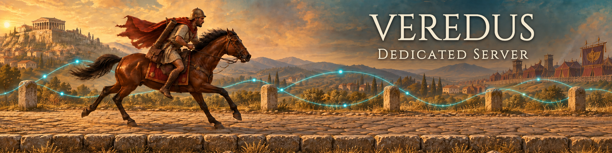

# Veredus - Dedicated Server



[](https://github.com/victorcrimea/veredus/actions/workflows/ci.yml)
[](https://github.com/victorcrimea/veredus/releases)
[](LICENSE)

Veredus is an always-on multiplayer server for
[0 A.D.](https://play0ad.com/), the free real-time strategy game. Run it on
a VPS or a spare machine and your group gets a game that is always there to
join. No player has to host, and the match keeps going when someone's
connection drops.

Players use the normal, unmodified game and join the server like any other
multiplayer game.

**Works with 0 A.D. 0.28.0.**

What you get:

- Games that never depend on one player's computer or internet connection.
- Dropped players can rejoin a match in progress.
- Out-of-sync detection that tells players when their games disagree, instead
  of letting a match silently fall apart.
- Observers who watch a few minutes behind live play, so streaming a match
  gives nothing away.
- Password-protected games, and limits that stop one player from spamming
  chat or pausing forever.
- With the optional sidecar: AI opponents hosted on the server, and a
  recorded result for every match, even if everyone left before the end.

## Download

Get the latest build from the
[Releases page](https://github.com/victorcrimea/veredus/releases):

| File | Use it on |
|---|---|
| `veredus-*-x86_64-unknown-linux-musl.tar.gz` | Linux, 64-bit PC or server (any distribution) |
| `veredus-*-aarch64-unknown-linux-musl.tar.gz` | Linux on ARM64 (Raspberry Pi 4/5, ARM cloud servers) |
| `veredus-*-x86_64-unknown-linux-gnu.tar.gz` | Linux, 64-bit, if you prefer a glibc build |
| `veredus-*-x86_64-pc-windows-msvc.zip` | Windows 10, 11 or Server, 64-bit |

The server is a single file with nothing to install. Each download comes
with a `.sha256` checksum if you want to verify it.

Each Linux file also comes as a `-sidecar` version, for example
`veredus-*-x86_64-unknown-linux-musl-sidecar.tar.gz`, which adds the
[sidecar](#extra-features-with-the-sidecar) ready to run.

## Quick start

1. Unpack the download and start the server.

   Linux:

   ```sh
   tar xzf veredus-*-x86_64-unknown-linux-musl.tar.gz
   cd veredus-*-x86_64-unknown-linux-musl
   ./veredus
   ```

   Windows: unzip it, open a terminal in that folder and run `veredus.exe`.
   When Windows Firewall asks, allow access.

2. Let players reach it: allow **UDP port 20595** through your firewall. At
   home, also forward that port on your router to the server machine.

3. In 0 A.D., choose **Multiplayer**, then **Join game**, and enter the
   server's IP address and port 20595.

The first player to join is the host: they pick the map and settings and
start the game, just like with a normal player-hosted game. When a match
ends, the server opens a fresh game on the same port.

Stop the server with Ctrl+C. Players get a "server shutdown" message instead
of just timing out.

## Extra features with the sidecar

The server itself never runs the game. Some features need a real copy of
the game engine running next to it, which we call the sidecar:

- **AI opponents** played on the server instead of on one player's PC.
- **Rejoining** even when no other player's game can send the joiner a copy
  of the match.
- **Match results** worked out on the server and written to a file.
- **Matches that survive a restart.** When you stop the server during a
  match, or it crashes, the match continues when you start it again. See
  [Restarts](#restarts).

The sidecar is 0 A.D. 0.28.0 with a small set of patches, kept in this
repository. The easiest way to get it is a `-sidecar` download for Linux:
it has the sidecar in its `sidecar` folder, next to the server. From that
folder, start the server with:

```sh
./veredus --pyrogenesis-path sidecar/binaries/system/pyrogenesis
```

The ready-made sidecar needs a Linux with glibc 2.36 or newer, such as
Debian 12 or Ubuntu 24.04 and later, even in the musl downloads. There is
no Windows sidecar yet. On other systems you can
[build it from source](#building-the-sidecar) and point the server at it:

```sh
./veredus --pyrogenesis-path /path/to/0ad/binaries/system/pyrogenesis
```

To keep each match's result as a JSON file, add `--outcome-dir results`.

## Restarts

The server saves every running match as it goes, into a `saves` folder next
to where you start it (`--save-dir` picks another folder). If you stop the
server during a match, or it crashes, it picks the match up again the next
time it starts:

1. Players reconnect the way they joined. Outside the lobby that is the
   same address and port. In the lobby, the match shows up in the game
   list again, under the same server name.
2. Each player gets their own slot back. Anyone else can only watch. AI
   opponents come back on their own.
3. The match stays paused until the host types `!resume` in chat. After
   five minutes, any returning player can.

This works best with the sidecar, and matches with AI opponents need it.
Without the sidecar, set `[saves] client_state_interval_secs` (for example
300). Every so often the server then asks one player's game for a copy of
the match, which pauses the game for a moment. To start fresh instead, run
with `--no-resume`.

## Hosting in the multiplayer lobby

Veredus can also appear in the in-game multiplayer lobby. You give it one
or more lobby accounts, which wait in the lobby chat. A player who types
`hostme` in the lobby chat gets a new game from a free account. The game
appears in the game list, the player who asked is its host, and each
account hosts one game at a time.

**Before you do this on the official Wildfire Games lobby, get approval
from the lobby's operators.** The server accounts behave like bots, and the
lobby is a shared community space.

Create a `lobby.json`:

```json
{
  "accounts": [
    { "jid": "myserver1@lobby.wildfiregames.com", "password": "..." },
    { "jid": "myserver2@lobby.wildfiregames.com", "password": "..." }
  ],
  "muc_room": "arena28@conference.lobby.wildfiregames.com",
  "bot_jid": "wfgbot28@lobby.wildfiregames.com/CC",
  "public_ip": "203.0.113.10",
  "server_name": "My Veredus server"
}
```

- `public_ip` is the address players connect to.
- `game_password` is optional and sets a password for every game.
- Keep this file private: it holds account passwords.

Then run:

```sh
./veredus --lobby-config lobby.json
```

Lobby games use UDP ports **20595 to 20695**, so open that whole range.

## Configuration

The defaults are fine to start with. To change anything, write a config
file, edit it and restart:

```sh
./veredus --gen-config          # writes ./config.toml
```

`./config.toml` is loaded automatically when it exists. You can pick
another file with `--config other.toml`. Command line flags override the
file. `./veredus --help` lists every flag.

Things people commonly change:

- `[server] host` and `port` set where the server listens; `port` is the
  game port for a server outside the lobby.
- `[lobby]` turns lobby hosting on and holds the public address and the
  accounts.
- `[match] server_name` and `welcome_message` set what players see.
- `[observers] delay_turns` sets how far behind observers watch
  (0 means live).
- `[pause] budget_secs` limits how long each player may pause.

The file runs from the settings most servers change to the ones almost none
do; `[advanced]` at the end is best left alone. A config file written for an
older version is refused with an "unknown field" error: write a fresh one with
`--gen-config` and copy your values over.

## Running as a service

On Linux, a systemd unit keeps the server running across reboots and
crashes. Save this as `/etc/systemd/system/veredus.service`:

```ini
[Unit]
Description=Veredus 0 A.D. server
After=network-online.target
Wants=network-online.target

[Service]
User=veredus
WorkingDirectory=/opt/veredus
ExecStart=/opt/veredus/veredus
Restart=on-failure

[Install]
WantedBy=multi-user.target
```

Create the `veredus` user (or change `User=`), then run
`sudo systemctl enable --now veredus`. The logs are in
`journalctl -u veredus`.

On Windows, run `veredus.exe` from Task Scheduler ("At startup") or wrap it
as a service with a tool such as [NSSM](https://nssm.cc/).

## Building from source

With a current stable [Rust](https://rustup.rs/) toolchain:

```sh
cargo build --release
```

The binary is `target/release/veredus` (`veredus.exe` on Windows).

## Building the sidecar

The sidecar is the official 0 A.D. 0.28.0 release plus the patches in this
repository's `sidecar/patches` folder. Get them by cloning this repository,
or from the source code archive on the
[Releases page](https://github.com/victorcrimea/veredus/releases). The
sidecar must match the 0.28.0 game your players run.

It builds like 0 A.D. itself. First install the build dependencies listed
in the official
[build instructions](https://gitea.wildfiregames.com/0ad/0ad/wiki/BuildInstructions),
plus [Git LFS](https://git-lfs.com/) for the game data. Then, on Linux:

```sh
git lfs install
git clone --branch v0.28.0 --depth 1 https://gitea.wildfiregames.com/0ad/0ad.git
cd 0ad
for p in /path/to/veredus/sidecar/patches/*.patch; do git apply "$p"; done
libraries/build-source-libs.sh -j"$(nproc)"
build/workspaces/update-workspaces.sh --without-atlas --without-tests
make -C build/workspaces/gcc config=release -j"$(nproc)"
```

The result is `binaries/system/pyrogenesis`. Keep it inside the cloned
folder, because it loads the game data from there, and pass its path to
`--pyrogenesis-path`.

## License

Veredus is licensed under Apache-2.0, see [LICENSE](LICENSE).

The sidecar patches in `sidecar/patches` change 0 A.D., so they are
licensed like 0 A.D.'s code, under GPL-2.0 or later, see
[sidecar/LICENSE](sidecar/LICENSE). 0 A.D.'s art is CC BY-SA 3.0.
